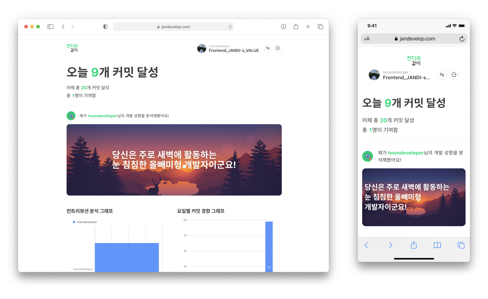
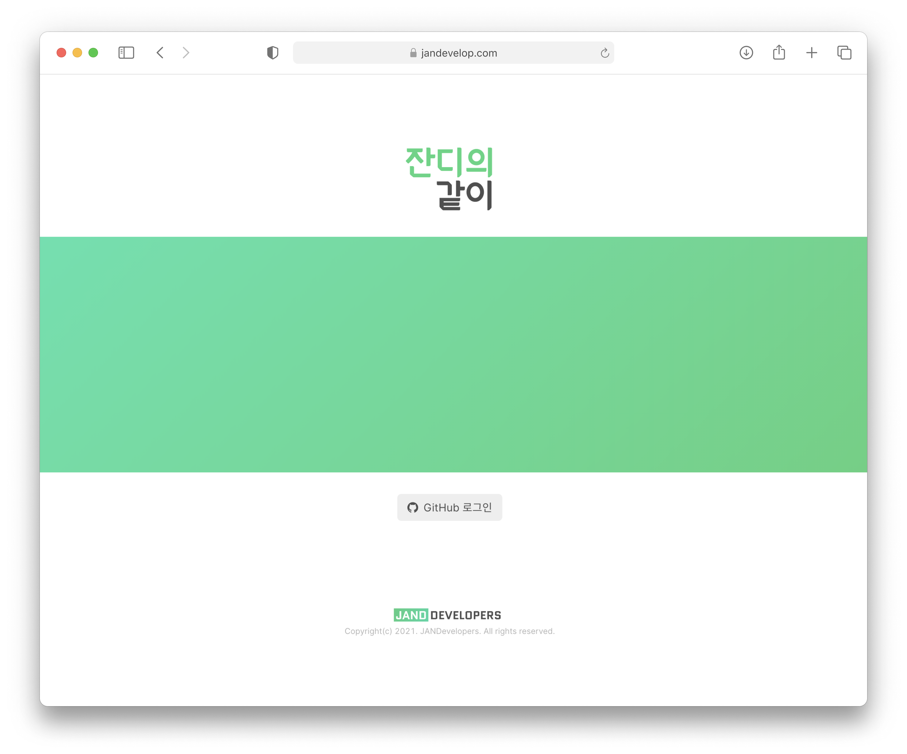
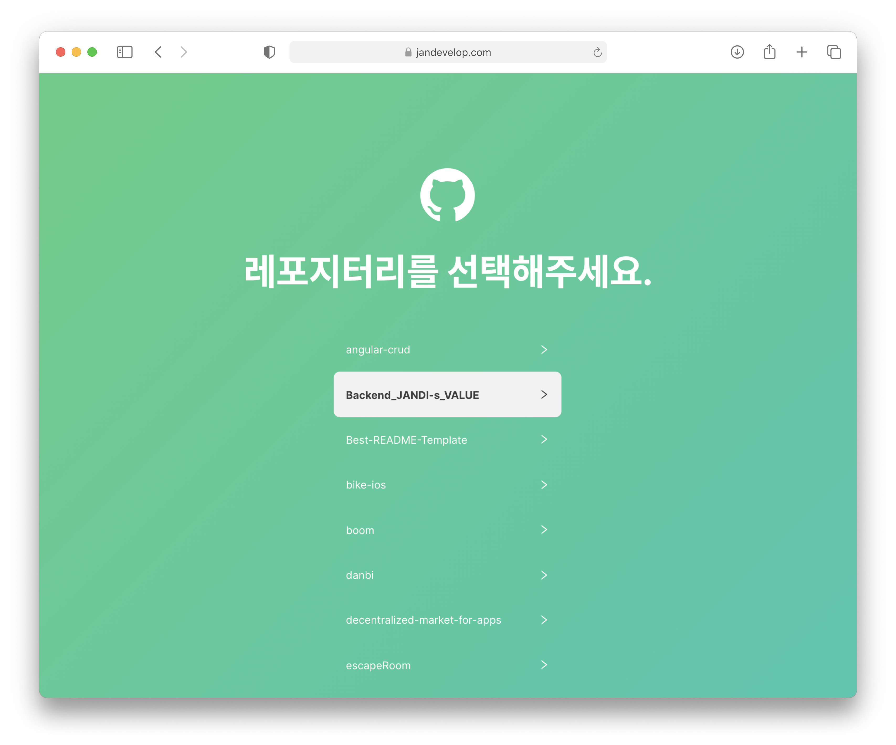
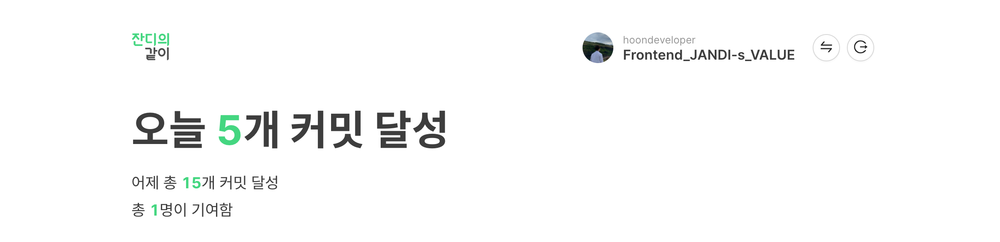
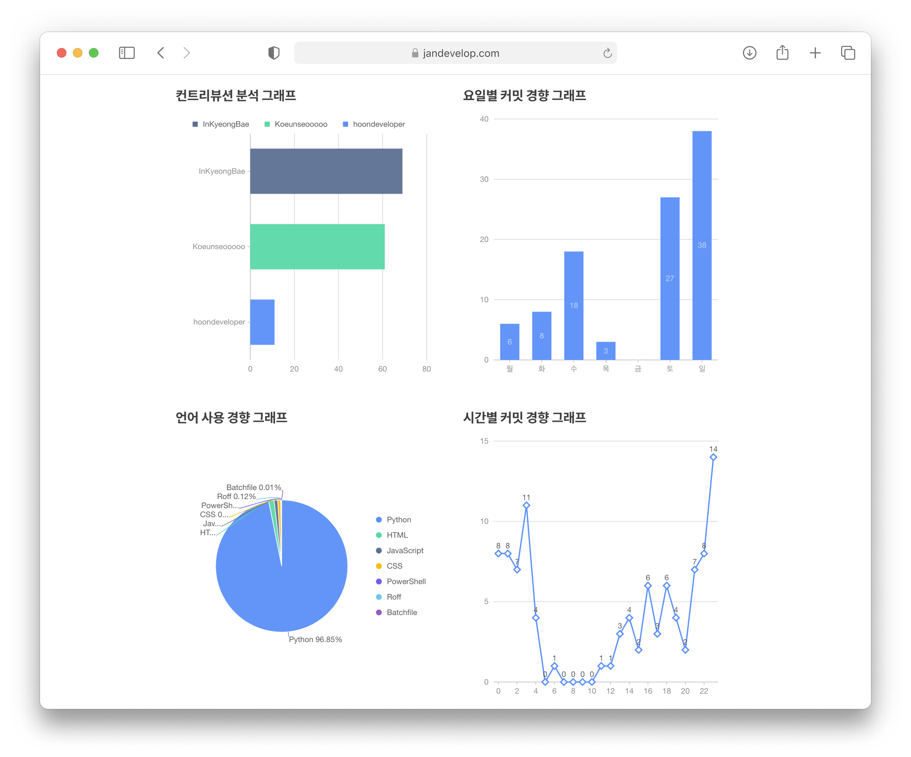

<div align="center">
    
</div>
<div align="center">
    
</div>


## 🎥 Live Service

- **Live Service**
  - [Go](https://www.jandevelop.com)
- Beta for testing
  - [Go](https://frontend-jandi-s-value-git-develop-hoondeveloper.vercel.app/intro)


## ✈️ Tech stacks

### Core

- React 17
- TypeScript
- RxJS for Reactive Programming
- OAuth 2.0 for Access-Token handling
- Context API
- React Router
- Axios for using RESTful API
- Local Storage
- Craco for customizing CRA

### Styling

- @emotion
- TailwindCSS
- twin.macro
- PostCSS 7
- autoprefixer
- node-sass for using SCSS

### Data Visualization

- Antd
- Antd Chart

### Code Linting

- ESLint
- Prettier
- @emotion/babel-preset-css-prop

### CI

- Vercel
- Heroku

## 🛰 Features

### Authentication

<div align="center">
    
    
</div>


- OAuth 2.0 Token Handling
  - When we toggle `GitHub Login Button`, this app requests authorization information to GitHub.
  - Then, we requests `Access Token` to our back-end server.
- Conditional Routes (natively functioned)
  - if you are not authenticated, any private routes **can't be accessed.**
  - In root, the conditional routes **prevent** users from `NOT AUTHENTICATED`.
- Updating Authentication States
  - After authentication, users can update or renew auth states.
    - Change target repository
    - Sign out && **revoke** `Access Token`


### Data Analysis

#### Repository Summary

<div align="center">
    
</div>

It is difficult to see the summary of the Repository on the existing GitHub homepage. Even in **Insight** provided by GitHub, special commits such as merged commits are counted **as excluded**.

So, we implemented the **server-side** to aggregate and display **actual data** by counting commits **one by one**.

Data provided are today's commits, yesterday's commits, and the total number of contributors.

#### Personalization

<div align="center">
    
</div>

By default, GitHub doesn't tell you the exact time you made a commit. Even if you can check directly using API, it is very **difficult** to see, and **it is difficult to understand the your development tendency**.

We aggregate and analyze the user's contributions logged in to the selected repository to inform **the user's development tendency.**

Currently, only limited analysis is provided, but more analysis data will be provided in the future.

#### Features

- Hourly tendency `✈️Live`
- Commit size tendency `👷🏼‍♂️Developing`

### Data Visualization

<div align="center">
    
</div>


Request **all commit data**, aggregate and analyze it from **various aspects** to visualize meaningful data. This allows developers to understand their development tendencies in various aspects.

#### Features

- Contributor score graph `✈️Live`
- Daily commit tendency graph `✈️Live`
- Timely commit tendency graph `✈️Live`
- Language usage tendency graph `✈️Live`
- Commit quality per commit `👷🏼‍♂️Developing`
- Ranking system within Jandi's Value users `👷🏼‍♂️Developing`

### Data Caching

This app is running based on GitHub REST API v3. The public API, as everyone knows, has a request **limit**. To maximize that limit, requests are used using **OAuth tokens**, but excessive requests can result in usage restrictions and service disruption.

So, to avoid this, we use **RxJS to caching data**.

- Data that does not need to be **retrieved** are cached as much as possible.
- Dynamic data everytime changes is **cached and initialized** at regular intervals.

### Cross-platform

#### Supported platforms

- PC with Modern Browsers (Not support Internet Explorer 11⬇)
  - Chrome
  - Edge
  - Safari
  - Firefox
  - Opera
- Mobile with every browsers
  - **Mobile Responsive Design Provided (100% Service Coverage)**

## 🏎 Getting Started

### Development

1. Clone this repository

   ```bash
   $ git clone https://github.com/CLUG-kr/Frontend_JANDI-s_VALUE.git
   ```

2. Install node packages with npm

   ```bash
   $ npm i
   ```

3. Start developing

   ```bash
   $ npm run start
   ```

### Deployment

- Vercel (stable)
- Netlify (stable)
- Firebase (stable)

## 😎 Customizing

- Core
  - Authentication
    - `src/oauth/AuthData.ts` (Client ID, Client Secret, Redirect URI)
- Styles
  - Background Gradient
    - `src/styles/Common.ts` (emotion css object)
  - Font
    - `src/styles/font.scss`
- Theme Overrides
    - `src/styles/theme-override.scss`
  
    

## 🐛 Bug Report

[Issues](https://github.com/CLUG-kr/Frontend_JANDI-s_VALUE/issues)

## 💻 Contribution Guide

### Pull Request

#### Forked strategy

```sh
# Fork this repository to yours.
$ git clone https://github.com/CLUG-kr/Frontend_JANDI-s_VALUE.git
$ cd gatsby-starter-bee

# Install npm packages and start this project.
$ npm install
$ npm run start

# (Working on your own..!)

# After that
$ git commit [...]
$ git push origin [YOUR_REPOSITORY]

# Enroll pull-request!
```

### Commit message rules

Consider starting the commit message:

- `refactor:` prefix.
  - when setting new development environment or refactoring codes
- `feat:` prefix.
  - when creating new feature.
- `fix:` prefix.
  - when fixing a bug.
- `docs:` prefix.
  - when adding document.

## LICENSE

Not yet decided.
